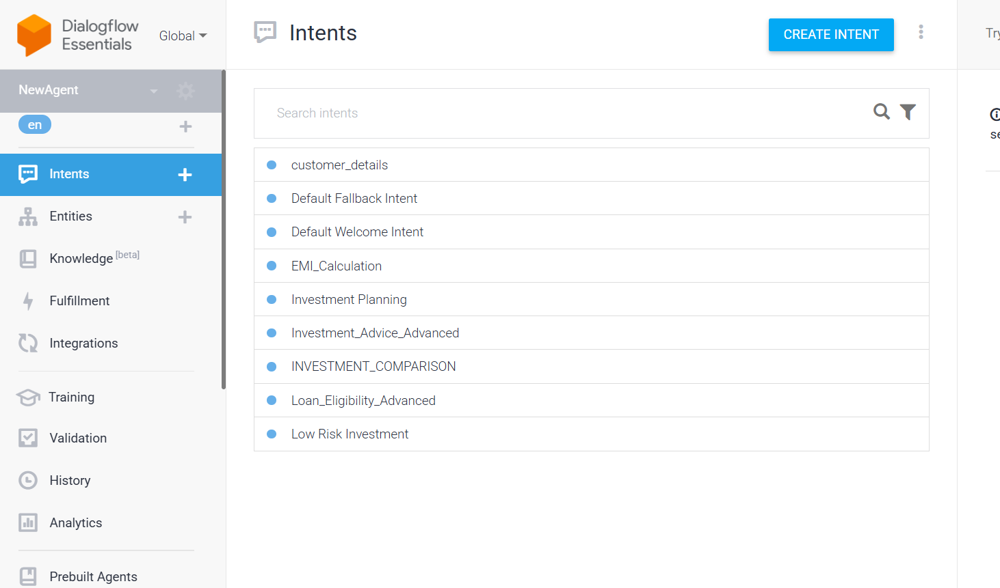
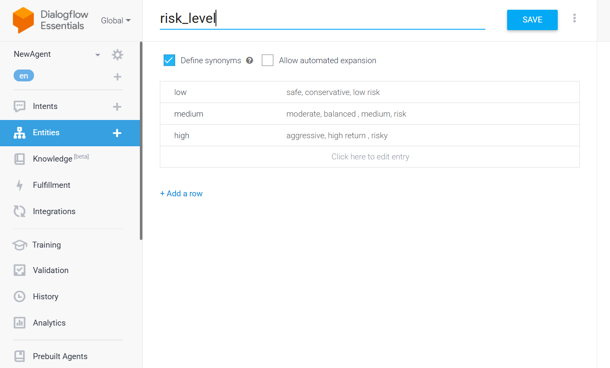

# 💰 FINANCIAL ASSISTANT – Personal Finance AI Chatbot

An AI-powered Personal Finance Assistant built using Google Dialogflow and NLP concepts.

This chatbot helps users with:

- 🏦 Loan Eligibility Checking
- 📊 EMI Calculation
- 💹 Investment Advice
- 🤖 Smart Financial Guidance

The project demonstrates the practical implementation of Artificial Intelligence and Natural Language Processing (NLP) in the FinTech domain.

---

# 📌 Project Overview

Many people struggle with:

- Understanding loan eligibility
- Calculating EMI manually
- Choosing suitable investments
- Accessing financial guidance anytime

Traditional financial consultation can be slow, expensive, and unavailable 24×7.

To solve this problem, this chatbot was developed as an intelligent finance assistant that provides quick and personalized financial support using Dialogflow NLP technology.

---

# 🚀 Features

- AI-powered financial chatbot
- Loan eligibility prediction
- EMI calculation support
- Investment guidance
- NLP-based intent recognition
- Smart entity extraction
- Real-time conversational responses
- User-friendly chatbot interaction

---

# 🤖 Technologies Used

- Google Dialogflow
- Natural Language Processing (NLP)
- Machine Learning Concepts
- Intent Classification
- Entity Extraction
- Slot Filling
- FinTech Logic
- AI-based Chatbot Design

---

# 🧠 AI & NLP Concepts Used

## ✅ Intent Classification

Identifies what the user wants.

### Examples:
- EMI Calculation
- Loan Eligibility
- Investment Advice

---

## ✅ Entity Extraction

Extracts important values such as:

- Income
- Loan Amount
- Interest Rate
- Risk Level

---

## ✅ Slot Filling

If some information is missing, the chatbot automatically asks follow-up questions.

---

## ✅ Custom Entity

Custom Entity Created:

```text
risk_level
```

Values:
- LOW
- MEDIUM
- HIGH

---

# 📂 Project Modules

# 🏦 1. Loan Eligibility Module

## Intent

```text
Loan_Eligibility_Advanced
```

## Features

- Checks loan eligibility using salary
- Uses EMI affordability logic
- Suggests safer loan options
- Mentions credit score requirements

## Example Query

```text
I earn 60000, can I get 20 lakh home loan?
```

---

# 📊 2. EMI Calculation Module

## Intent

```text
EMI_Calculation
```

## Features

- Calculates monthly EMI
- Accepts loan amount, interest rate, and tenure
- Provides estimated repayment details

---

# 🧮 EMI Formula

```text
EMI = P × r × (1 + r)^n / ((1 + r)^n – 1)
```

Where:

- P = Principal Amount
- r = Monthly Interest Rate
- n = Loan Tenure

---

# 💹 3. Investment Advice Module

## Features

- Risk-based investment suggestions
- SIP guidance
- Mutual fund recommendations
- Fixed deposit comparison

---

# 🟢 LOW RISK

- Fixed Deposits
- Government Bonds
- Debt Mutual Funds

### Expected Returns

```text
6–7% p.a.
```

---

# 🟡 MEDIUM RISK

- Balanced Mutual Funds
- Index Funds
- SIP Investments

### Expected Returns

```text
10–12% p.a.
```

---

# 🔴 HIGH RISK

- Equity Mutual Funds
- Stock Market Investments
- Aggressive Growth Funds

### Expected Returns

```text
12–18% p.a.
```

---

# ⚙️ Dialogflow Architecture

```text
User Input
     ↓
Dialogflow NLP Engine
     ↓
Intent Matching
     ↓
Entity Extraction
     ↓
Slot Filling
     ↓
Response Generation
     ↓
User Receives Output
```

---

# 📁 Intents Configured

- Default Welcome Intent
- Default Fallback Intent
- Loan_Eligibility_Advanced
- EMI_Calculation
- Investment_Advice_Advanced
- Investment Planning
- Low Risk Investment
- Mutual Fund vs FD
- Loan_Request_With_Amount

---

# 📸 Project Screenshots

## Repository Preview


## Dialogflow Intents & Configuration



## Entity Configuration



---

# 📦 Repository Structure

```text
📁 Dialogue_Flow/
│
├── Dialogue Flow.zip
├── Entities.png
├── Intents.png
├── README.md
├── Screenshot 2026-05-07 115916.png
└── Screenshot 2026-05-07 115949.png
```

---

# 🛠️ How to Run the Project

## Step 1

Open Google Dialogflow Console.

---

## Step 2

Create a new Dialogflow agent.

---

## Step 3

Go to:

```text
Settings → Export and Import
```

---

## Step 4

Import:

```text
Dialogue Flow.zip
```

---

## Step 5

Test the chatbot in the Dialogflow console.

---

# 🎯 Key Features

✅ Loan Eligibility Assessment  
✅ EMI Calculation  
✅ Investment Advice  
✅ NLP-Based Chatbot  
✅ AI-Powered Financial Guidance  
✅ User-Friendly Interface  

---

# 📈 Future Improvements

- Webhook API integration
- Real-time banking APIs
- WhatsApp chatbot deployment
- Multi-language support
- Personalized AI recommendations
- Dashboard analytics

---

# 🎓 Learning Outcomes

Through this project, I learned:

- Dialogflow chatbot development
- NLP implementation
- Intent handling
- Entity extraction
- Slot filling techniques
- FinTech AI applications
- Conversational AI systems

---

# 🙌 Conclusion

FINANCIAL ASSISTANT is an AI-powered finance chatbot built using Google Dialogflow that provides:

- Instant loan eligibility checking
- EMI estimation
- Investment guidance
- Smart financial assistance

This project showcases how AI and NLP can improve financial accessibility and user experience in the FinTech industry.

---

# 👩‍💻 Author

**Kanica**

---

# ⭐ GitHub Upload Commands

```bash
git init
git add .
git commit -m "Added Financial Assistant AI Chatbot Project"
git branch -M main
git remote add origin YOUR_REPOSITORY_LINK
git push -u origin main
```

---

# 📎 Note

This project is created for educational and learning purposes to demonstrate AI-powered finance chatbot development using Google Dialogflow and NLP concepts.
